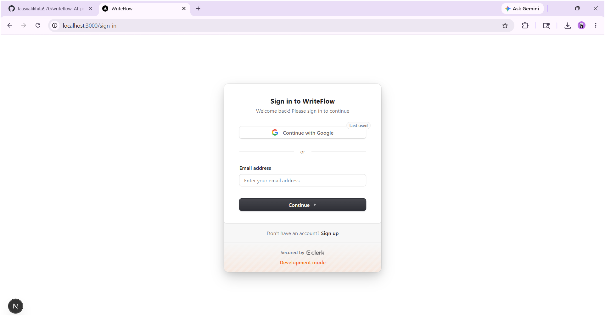
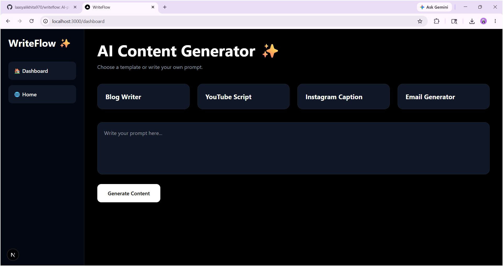
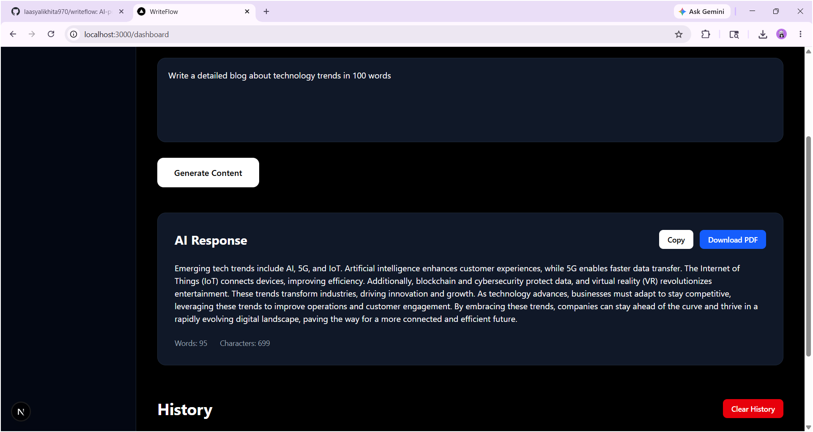
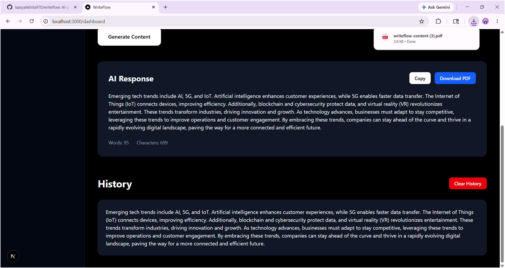
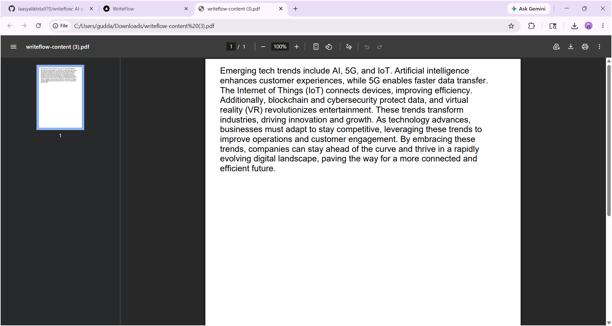

# WriteFlow AI

AI-powered content generation platform built using Next.js, TypeScript, Clerk Authentication, Supabase, and Groq AI.

---

## Live Demo

https://writeflow-rho.vercel.app

---

## Features

- AI-powered content generation
- Clerk authentication system
- Protected dashboard
- Supabase history storage
- Markdown rendering support
- PDF download feature
- Copy generated content
- Clear history functionality
- Responsive modern UI
- Full-stack API integration
- Vercel deployment

---

## Tech Stack

### Frontend
- Next.js 16
- React
- TypeScript
- Tailwind CSS

### Backend
- Next.js API Routes
- Groq AI API

### Authentication
- Clerk

### Database
- Supabase

### Deployment
- Vercel

---

## Screenshots

### Authentication



---

### Dashboard



---

### AI Response



---

### History Feature



---

### PDF Download



---

## Installation

Clone the repository:

```bash
git clone https://github.com/laasyalikhita970/writeflow.git
```

Move into project directory:

```bash
cd writeflow
```

Install dependencies:

```bash
npm install
```

Run development server:

```bash
npm run dev
```

---

## Environment Variables

Create a `.env.local` file in the root directory and add:

```env
NEXT_PUBLIC_CLERK_PUBLISHABLE_KEY=
CLERK_SECRET_KEY=

NEXT_PUBLIC_SUPABASE_URL=
NEXT_PUBLIC_SUPABASE_ANON_KEY=

GROQ_API_KEY=
```

---

## Project Structure

```bash
app/
 ├── api/
 │    ├── generate/
 │    ├── history/
 │    └── clear-history/
 │
 ├── dashboard/
 ├── sign-in/
 ├── sign-up/
 ├── components/
 │
 └── lib/
```

---

## Key Functionalities

### AI Content Generation
Users can generate:
- blogs
- email drafts
- YouTube scripts
- Instagram captions
- custom AI content

### Authentication
Implemented secure authentication using Clerk:
- Sign up
- Sign in
- Protected routes

### Database Integration
Supabase is used to:
- store AI generation history
- fetch previous generations
- clear stored history

### PDF Export
Generated AI responses can be downloaded as PDF files.

---

## Deployment

The project is deployed on Vercel.

Production URL:

https://writeflow-rho.vercel.app

---

## Challenges Faced

- AI API quota limits
- Environment variable configuration
- Supabase integration issues
- Vercel deployment errors
- Markdown rendering setup

---

## Future Improvements

- AI chat interface
- More AI templates
- User profile settings
- Usage analytics
- Subscription plans
- Rich text editor
- Multi-language support

---

## Author

Developed by Laasya Likhita

GitHub:
https://github.com/laasyalikhita970

---

## License

This project is open-source and built for learning and portfolio purposes.